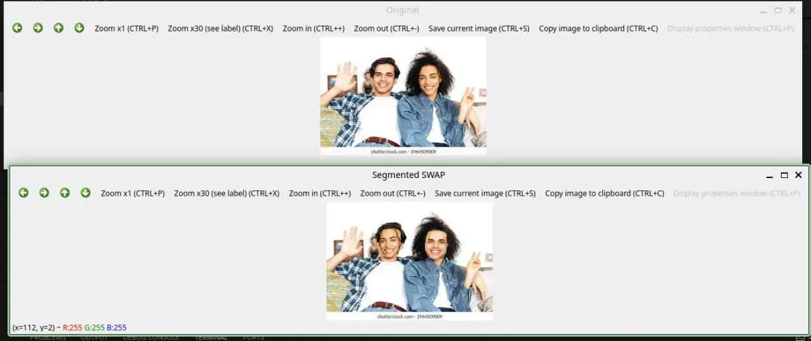

# Face Swap

This module performs face swapping between two individuals within a single image using 
computer vision techniques. It detects facial landmarks on both faces, aligns them geometrically, 
and maps one face onto the other.

## Table of Contents
- [How it works](#how-it-works)
- [Controls](#controls)
- [Step-by-step usage](#usage)
- [Understanding the code](#understanding-the-code)

## How it works

**How it works**

The effect relies on four steps:

1. **Segment objects** : each subject is isolated from the image using GrabCut-based segmentation. This separates foreground (the individuals) from the background, producing a rough cutout of both targets.

2. **Generate & refine masks** : binary masks are created by filtering out background-colored pixels. These masks are then smoothed using morphological operations (dilation followed by erosion) to remove noise and ensure clean, continuous regions.

3. **Extract & align regions** : bounding boxes are computed around each masked subject, and the corresponding foreground regions are extracted. These regions are resized to match each other’s dimensions so they can be swapped seamlessly.

4. **Swap & blend** : the original subjects are removed from the image, and their extracted counterparts are pasted into each other’s positions using their respective masks. This ensures that only the foreground pixels are transferred, preserving shape and minimizing visual artifacts.

Morphological operations help stabilize the masks by filling gaps and removing stray pixels, resulting in smoother edges and more natural-looking swaps.


## Controls

| Input | Action |
|------|--------|
| Mouse drag + key press | Select first face (ROI) |
| Mouse drag + key press | Select second face (ROI) |
| Any key | Proceed after each selection |
| `Q` (window close) | Exit application |

## Usage 

1. Open Terminal
2. Navigate to ```/home/<username>/Pixels/4_cv_basics/10_face_swap```
3. run   ```make clean``` to clean out any previous builds
  4. run ```make SRC=main.cpp link="src/segmentation.cpp src/processing.cpp"``` to build the executable
5. run ```./face_swap```
6. Drag your mouse while a key is pressed, to select the first face and press any key to proceed
7. Then, repeat the same process for the second face
8. Press ```Q``` to exit

## Understanding the code

#### `applyGrabCut()`

This is the core segmentation step. GrabCut uses the selected ROI to separate foreground (the person) from the background. Only definite and probable foreground pixels are retained, producing a clean cutout of the subject.

#### `extractForeground()`

```cpp
boundingBox = cv::boundingRect(mask);
image.copyTo(temp, mask);

foreground  = temp(boundingBox).clone();
croppedMask = mask(boundingBox).clone();
```

Extracts the subject using the mask and crops it to its bounding box. This isolates only the relevant region, making swapping more efficient and precise.

#### `pasteSwappedObjects()`

```cpp
fg1.copyTo(layer1(r2), m1);
fg2.copyTo(layer2(r1), m2);

layer1.copyTo(baseImage, maskL1);
layer2.copyTo(baseImage, maskL2);
```

Performs the actual swap. Each subject is pasted into the other’s location using masks, ensuring only foreground pixels are transferred while preserving the background.


